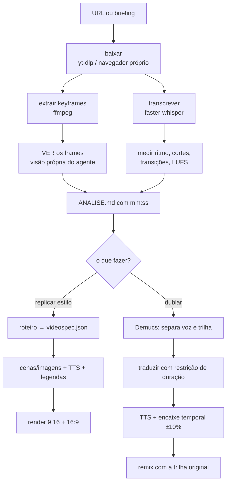

# Planejamento — Skills de Criação e Análise de Vídeo (Reels / Shorts / YouTube)

**Data:** 2026-08-09 · atualizado 2026-08-09 (princípio de autonomia)
**Autor:** planejamento gerado para o Álvaro
**Status:** 📋 SOMENTE PLANEJAMENTO — nenhum código foi escrito, nenhuma dependência foi instalada, nenhum script foi criado.

> Os blocos de comando neste conjunto de documentos são **ilustrativos** (especificação de como a skill deverá funcionar). Eles não foram executados nem salvos como scripts. A única coisa executada durante o planejamento foi a leitura de metadados públicos dos vídeos de referência e o inventário do ambiente local.

---

## 🚦 ORDEM DE EXECUÇÃO — as duas fases e o gate

> ### **FASE 1 (agora) — só o Hermes.**
> Desenvolver, testar e **validar 100%** a skill de vídeo do **Hermes** — análise, criação e dublagem — **operando pelo WhatsApp, com o Álvaro**.
> 👉 [`PLANO_HERMES.md`](PLANO_HERMES.md)
>
> ### 🔒 **GATE**
> A Fase 2 **não começa** enquanto todos os itens de **[`PLANO_HERMES.md` §6 — Critérios de validação](PLANO_HERMES.md)** não estiverem marcados **e** o Álvaro não disser *"tá validado"* depois de rodar os três eixos pelo celular.
>
> ### ⛔ **FASE 2 (só depois) — os outros quatro.**
> `PLANO_CLAUDE_CODE.md` · `PLANO_CURSOR.md` · `PLANO_OPENCODE.md` · `PLANO_CODEX.md` — **congelados** até o gate abrir.

**Por que em série, e não em paralelo.** A autonomia (§1) diz que os cinco agentes são *capazes* de trabalhar isolados — não que devam ser construídos ao mesmo tempo. São coisas diferentes:

| | |
|---|---|
| **Autonomia** (§1) | propriedade do **produto final**: nenhum agente depende de outro para rodar |
| **Ordem das fases** (aqui) | decisão de **construção**: um de cada vez, começando pelo que entrega valor primeiro |

O Hermes vem primeiro porque é o único que já está no bolso do Álvaro: o caso de ouro — *"vi um Reel no celular, mandei o link, o vídeo chegou pronto"* — só existe no WhatsApp. Os outros quatro são conveniências de terminal.

E porque o pipeline é o mesmo nos cinco: **tudo o que for descoberto construindo o Hermes** (prompt de visão que funciona, cascata de sincronia calibrada, presets de identidade, campos que faltam no `videospec.json`, tempo real de cada etapa) **chega aos outros quatro já resolvido**. Construir os cinco juntos significaria descobrir os mesmos erros cinco vezes.

---

## 1. Princípio fundador: **autonomia total por agente**

> **Cada um dos 5 agentes faz TUDO, sozinho, no ambiente dele.**
> O Álvaro manda para **um** agente — qualquer um — e recebe o resultado completo. Nenhuma etapa é roteada para outro agente. Nunca.

Isso vale para os três eixos:

| Eixo | O agente, sozinho, precisa conseguir |
|---|---|
| **Analisar** | baixar (inclusive atrás de login) → transcrever → extrair frames → **ver os frames** → medir ritmo, transições, legendas, áudio → relatório com `[mm:ss]` |
| **Criar** | roteiro → storyboard por cena → gerar cenas/imagens → narração (TTS) → edição (cortes, transições, legendas, trilha) → exportar 9:16 **e** 16:9 |
| **Dublar** | separar voz da trilha → traduzir com sincronia → TTS no idioma alvo → encaixe temporal → remix → legendas novas |

### O que "autonomia" significa — e o que não significa

**Significa:** nenhum agente espera, chama ou depende de outro agente. Se uma etapa exige uma capacidade que o modelo padrão não tem (ex.: visão), o plano daquele agente descreve **como ele resolve sozinho** — ferramenta própria, modelo auxiliar configurado, ou subagente **interno** do próprio agente.

**Não significa** recusar o sistema operacional. Os cinco rodam no mesmo Linux e usam as mesmas ferramentas de linha de comando (`yt-dlp`, `ffmpeg`, `whisper`, `edge-tts`). Usar `ffmpeg` não é depender de outro agente — é usar o SO. **Cada agente instala e verifica as suas próprias dependências**, com seu próprio comando de diagnóstico.

### Os 5 são intercambiáveis

Não há agente "mais capaz" para vídeo. Há **conveniências diferentes** — o Álvaro escolhe pelo contexto em que está, não pelo que o agente consegue fazer:

| Agente | Escolha quando… | Entrega |
|---|---|---|
| **Hermes** | está no celular, no WhatsApp — **é o padrão** | pipeline completo |
| **Claude Code** | está no terminal e quer olhar junto | pipeline completo |
| **Cursor** | quer **ver** o vídeo sendo montado | pipeline completo |
| **OpenCode** | são muitos vídeos, ou é de madrugada | pipeline completo |
| **Codex** | quer o pipeline testado e reprodutível | pipeline completo |

Cada plano descreve o **caminho próprio** daquele agente para cada etapa. Onde há sobreposição, é proposital: redundância é o preço da autonomia, e é barata — o custo real seria um agente parado esperando outro.

> ⚠️ **Intercambiável é o estado final, não o estado de hoje.** Enquanto o gate da Fase 1 não abrir, existe **um** caminho: o Hermes, pelo WhatsApp. A tabela acima descreve como será quando os cinco estiverem prontos.

---

## 2. As 3 skills (replicadas nos 5 ambientes)

| Skill | O que faz |
|---|---|
| `video-analise` | Baixa um vídeo (YouTube / Reels / TikTok / Shorts), transcreve, detecta cortes, mede ritmo, **enxerga os frames**, identifica estilo visual, trilha, narração e legendas → **relatório com referências de tempo** |
| `video-criacao` | Do briefing ao arquivo final: roteiro → storyboard por cena → geração de cenas/imagens → narração (TTS) → edição (cortes, transições, legendas, trilha) → export 9:16 e 16:9 |
| `video-dublagem` | Troca o idioma da narração preservando sincronia, remixando com a trilha original |

Cada agente implementa as três **inteiras**, dentro do próprio ambiente, com os próprios scripts auxiliares.

**Na Fase 1, quem implementa é só o Hermes** — e com uma quarta peça que os outros não têm: `references/protocolo-whatsapp.md`, o protocolo de conversa (entradas, entregas, perguntas, progresso) compartilhado pelas três skills. Ver [`PLANO_HERMES.md` §2](PLANO_HERMES.md).

---

## 3. Análise dos vídeos de referência (feita, não suposta)

Os 4 links foram acessados. **Três dos quatro deram sinal técnico real**; o que não abriu está registrado com a suposição explícita.

### 3.1 O fio condutor: tudo é **Jujutsu Kaisen**

Os 4 vídeos, de 2 criadores diferentes, orbitam o mesmo universo (JJK). Isso não é coincidência de nicho — é o insumo mais importante do planejamento: **a identidade visual/sonora de referência é "anime edit brasileiro, nicho JJK"**.

### 3.2 Modo A — Reels 9:16 (@silv.mind) · humor/reflexão com frame de anime

| Item | Reel 1 (`DbRURvqtWyp`) | Reel 2 (`DbJn9d1SWKt`) |
|---|---|---|
| Perfil | `@silv.mind` | `@silv.mind` |
| Proporção | 9:16 (thumb 640×1136) | 9:16 (thumb 640×1136) |
| Tema | Ansiedade de domingo à noite | Humor de relacionamento |
| Frame narrativo | "técnicas amaldiçoadas" (JJK) | "Técnica Amaldiçoada: *Você Que Sabe*" |
| CTA | seguir, curtir, salvar, **mandar pra alguém** | **comentar e marcar** a pessoa |
| Hashtags | #JujutsuKaisen #JujutsuKaisenEdit #JJK + tema | idem |

**Fórmula extraída (esqueleto reutilizável):**

```
[0–3s]   HOOK — afirmação universal e específica ("O domingo à noite tem uma energia diferente")
[3–12s]  DESENVOLVIMENTO — descreve a dor em detalhes concretos (despertador, aula, trabalho)
[12–20s] VIRADA — o frame de anime nomeia a dor como "técnica amaldiçoada"
[20–30s] PUNCHLINE — a conclusão irônica ("ninguém está realmente preparado")
[final]  CTA explícito e específico — sempre pedindo UMA ação social (marcar/mandar)
```

Sinais de estilo (a confirmar no pixel quando houver acesso ao arquivo — ver §3.4):
- narração ou texto sobre cenas de anime, ritmo alto, legendas grandes queimadas;
- linguagem coloquial em 3ª pessoa ("a pessoa lembra do despertador") — distanciamento irônico;
- o CTA é **parte do roteiro**, não um adendo.

### 3.3 Modo B — YouTube 16:9 (RM RAPS) · videoclipe de rap geek

| Item | "Acima do Infinito \| Satoru Gojo" | "Além do Cosmos \| Dabura Kabara" |
|---|---|---|
| ID | `XZX7GI9C6Tw` | `O5OyGrDfU1A` |
| Duração | 224s (3:44) | 228s (3:48) |
| Views | 3.085.194 | 14.691 |
| Publicado | 2026-01-31 | 2026-08-01 |
| Formato | 1280×720, 16:9 | 1280×720, 16:9 |
| Legendas | pt (ASR automática) | — |

**Créditos (informação de ouro — o pipeline de produção está escrito na descrição):**

| Função | Vídeo Gojo | Vídeo Dabura |
|---|---|---|
| Composição e letra | RM RAPS | RM RAPS |
| Beat/Instrumental | — | Kailu_beat |
| Guia de voz | RM RAPS | RM RAPS (+ vocais de apoio) |
| **Processamento vocal** | **IA** | **IA** |
| Pós-mix / masterização | RM RAPS | RM RAPS |
| Ilustração / thumb / artes | RM RAPS | Gaab |
| Edição visual | @PainEditz77 | Kishi |
| Legendas | — | Titosxx |

**O que isso ensina ao planejamento:** o fluxo de referência **não** é "IA faz tudo". É *humano compõe → guia de voz humana → IA faz o processamento vocal (conversão de timbre) → humano mixa → artista ilustra → editor corta*. As skills devem espelhar esse pipeline com **pontos de entrada humanos**, não tentar substituí-lo.

Nota de escala: 3,08 M × 14,7 k na mesma fórmula mostra que **o teto não vem do pipeline técnico** (idêntico nos dois) — vem do personagem/tema escolhido. A skill de análise deve capturar isso como métrica, não só como estética.

### 3.4 O que NÃO foi possível obter (suposições registradas)

| Bloqueio | Detalhe técnico | Consequência / suposição adotada |
|---|---|---|
| **Vídeo dos Reels** | `yt-dlp` no Instagram exige login/cookies: *"Requested content is not available, rate-limit reached or login required"* | Só a legenda de texto foi obtida (via endpoint público `oembed`). **Suposição adotada:** estilo "Reels/Shorts com narrativa envolvente, edição dinâmica, legendas queimadas, narração/dublagem" — conforme instruído. Ritmo de corte, fonte, cor de legenda e trilha **não foram medidos**. |
| **Vídeo do YouTube** | `yt-dlp` 2024.04.09 (pacote apt) retorna `Requested format is not available` — extractor desatualizado | Metadados obtidos por raspagem HTML direta. **Ação de implementação:** instalar `yt-dlp` novo via `uv tool install` / `pipx`, **nunca** confiar no apt |
| **Transcrição do YouTube** | endpoint `timedtext` devolve corpo vazio (0 byte) mesmo com a trilha `pt/asr` listada — YouTube passou a exigir *proof-of-origin token* | **Decisão de arquitetura:** as skills **não devem depender** de legenda do YouTube. Transcrição própria com `faster-whisper` sobre o áudio é o caminho padrão. |

> **Cada agente resolve o bloqueio do Instagram sozinho**, pelo caminho que tem: `chrome-agente` (Claude Code), tool `browser` (Hermes), terminal com `--cookies-from-browser` (Cursor, OpenCode, Codex). Detalhes em cada plano.

---

## 4. Ambiente atual (inventário real desta máquina)

| Recurso | Estado |
|---|---|
| `ffmpeg` | ✅ 6.1.1 — com `libx264`, `libx265`, `xfade`, `zoompan`, `ass`/`subtitles`, `loudnorm`, `concat` |
| **VAAPI** | ✅ `h264_vaapi`, `hevc_vaapi`, `av1_vaapi` — **encode por GPU AMD (Lucienne)**, muito mais rápido que CPU |
| `yt-dlp` | ⚠️ 2024.04.09 (apt) — **quebrado para YouTube**, precisa substituir |
| `python3` | ✅ 3.11.14 · `uv` ✅ · `pipx` ✅ |
| `node` | ✅ v22.22.2 · `npm` 10.9.7 |
| Whisper / TTS / MoviePy / Demucs | ❌ nada instalado no sistema (o Hermes tem TTS próprio — ver `PLANO_HERMES.md`) |
| GPU | AMD Lucienne (iGPU) — **serve para encode (VAAPI), não para gerar imagem/vídeo local** |
| RAM | 11 GB (≈4 GB livres) — limita modelo de transcrição e proíbe difusão local |
| Disco | 160 GB livres em `/` |
| Agentes | `opencode` ✅ · `codex` ✅ (gpt-5.6-sol, reasoning high, aceita `-i imagem`) · Hermes ✅ · Cursor (app GUI) · Claude Code ✅ |

**Consequência arquitetural:** geração de imagem/vídeo é **API remota** (ou a tool `image_gen`/`video_gen` do Hermes), não local. Transcrição e edição são **locais**. TTS começa grátis (`edge-tts`, ou a tool `tts` do Hermes).

> 🔴 **Bloqueio conhecido, a resolver na Fase 1:** o `.env` do Hermes tem hoje apenas `DEEPSEEK_API_KEY` e `GROQ_API_KEY`. **Não há credencial de geração de imagem ou vídeo** (`FAL_KEY`, `XAI_API_KEY`, …), então as tools `image_gen`/`video_gen` aparecem mas não produzem nada. Ou se acrescenta uma chave, ou as cenas saem de material próprio + `zoompan`. Detalhes em [`PLANO_HERMES.md` §5](PLANO_HERMES.md).

---

## 5. Formato comum de arquivo (padrão, **não** dependência)

Os cinco agentes gravam os resultados no mesmo formato. Isso existe para que o Álvaro possa abrir em qualquer lugar o que foi produzido em outro — **não** para criar dependência. Nenhum agente precisa que outro tenha rodado antes; cada um cria a estrutura do zero quando ela não existe.

> Pense em `.srt`: qualquer editor lê e escreve, e nenhum depende de outro editor.

### 5.1 Estrutura de pastas

```
~/Documentos/Video_Studio/
├── refs/<slug>/                  # material analisado
│   ├── fonte.mp4  fonte.info.json
│   ├── audio.wav  vocals.wav  music.wav
│   ├── transcricao.json          # segmentos + palavras com timestamp
│   ├── cenas.csv                 # cortes detectados
│   ├── keyframes/00m03s.jpg …
│   └── ANALISE.md                # relatório humano, com [mm:ss]
├── projetos/<slug>/
│   ├── videospec.json            # ⭐ o formato comum (§5.2)
│   ├── roteiro.md
│   ├── narracao/cena01.wav …
│   ├── assets/                   # imagens geradas ou fornecidas
│   ├── legendas.ass
│   └── render/final_9x16.mp4  final_16x9.mp4
└── dublagem/<slug>/<idioma>/
    ├── traducao.json  narracao/*.wav  mix.wav  final.mp4
```

Cada agente mantém **suas próprias ferramentas** em pasta própria (`~/.claude/skills/…/scripts`, `~/.hermes/skills/…`, `studio/src/…`, `.opencode/…`, `src/vs/…`). Não há binário central mantido por um agente para os outros.

### 5.2 `videospec.json` — o formato comum

```jsonc
{
  "slug": "tecnica-amaldicoada-domingo",
  "modo": "A",                     // A = Reel 9:16 · B = clipe musical 16:9
  "gerado_por": "hermes",          // qual agente produziu (rastreio, não dependência)
  "idioma_origem": "pt-BR",
  "formato": { "principal": "9:16", "tambem": ["16:9"], "fps": 30 },
  "duracao_alvo_s": 32,
  "identidade": { "preset": "jjk-dark", "fonte": "...", "cor_destaque": "#7B2FF7" },
  "audio": { "trilha": "assets/beat.mp3", "lufs_alvo": -14, "ducking_db": -8 },
  "narracao": { "motor": "edge-tts", "voz": "pt-BR-FranciscaNeural", "ritmo": "+8%" },
  "legendas": { "estilo": "karaoke-palavra", "safe_area": true },
  "cenas": [
    {
      "id": 1, "papel": "hook", "inicio_s": 0.0, "fim_s": 3.2,
      "fala": "O domingo à noite tem uma energia diferente.",
      "visual": { "tipo": "clipe", "fonte": "assets/jjk_01.mp4", "movimento": "zoom-in-lento" },
      "transicao_saida": { "tipo": "corte-seco" },
      "texto_tela": "DOMINGO 19h"
    }
  ],
  "cta": { "texto": "Marca aquela pessoa que sofre no domingo", "em_s": 27.0 },
  "publicacao": { "hashtags": ["#JujutsuKaisen", "#JJK", "#JujutsuKaisenEdit"] }
}
```

**Regra de convivência:** quem precisar acrescentar um campo, acrescenta — e ignora campo que não reconhece. Formato tolerante evita que a evolução de um agente quebre outro.

---

## 6. Stack de ferramentas (mesma base, instalada por cada agente)

| Etapa | Escolha primária | Alternativa | Observação |
|---|---|---|---|
| Download | `yt-dlp` (versão nova via `uv tool install`) | `gallery-dl` | Instagram exige cookies ou navegador |
| Transcrição | `faster-whisper` (CTranslate2, `int8`) | `whisper.cpp` | Nesta máquina: `medium` no dia a dia, `large-v3` no passe final |
| Timestamp por palavra | `WhisperX` (alinhamento forçado) | `--word_timestamps` | Necessário para legenda karaokê e para dublagem |
| Separação voz/trilha | `Demucs` (`htdemucs`) | `spleeter` | Essencial na dublagem: preserva a música original |
| Detecção de cortes | `PySceneDetect` (`detect-adaptive`) | `ffmpeg select='gt(scene,0.3)'` | Gera a métrica **cortes/minuto** |
| BPM / batida | `librosa` / `aubio` | — | Modo B: cortes **na batida** separa amador de bom |
| **Análise visual** | **cada agente tem a sua** — ver tabela §7 | — | nunca terceirizada a outro agente |
| Loudness | `ffmpeg loudnorm` 2-passes | — | Alvo −14 LUFS integrado, pico −1 dBTP |
| TTS pt-BR | `edge-tts` (`pt-BR-AntonioNeural`, `pt-BR-FranciscaNeural`, `pt-BR-ThalitaMultilingualNeural`) | `piper` (offline) | Custo zero, qualidade boa |
| Voz premium / clonada | ElevenLabs (tem API de *dubbing*) | Fish-Speech, F5-TTS | ⚠️ **XTTS-v2 é CPML: proíbe uso comercial** |
| Imagem | Flux / SDXL via **fal.ai** ou **Replicate** | tool `image_gen` (Hermes) | Local inviável (iGPU + 11 GB) |
| Vídeo generativo | Kling / Runway / Luma | tool `video_gen` (Hermes) · Ken Burns via `zoompan` | `zoompan` custa **zero** e resolve 80 % do Modo A |
| Edição | `ffmpeg` (concat + `xfade` + `ass`) | **Remotion** (nativo no Cursor) | ambos disponíveis a quem quiser instalar |
| Corte de silêncio | `auto-editor` | — | Só quando houver fala gravada |

### Especificações de export (fixar no `videospec.json`)

**9:16 (Reels / Shorts / TikTok)** — 1080×1920, 30 fps, H.264 High, CRF 18–20 (ou ~12 Mbps), `yuv420p`, AAC 192 kbps 48 kHz, `-movflags +faststart`.
**16:9 (YouTube)** — 1920×1080, mesmos codecs, CRF 18.

**Safe area 9:16 (regra prática):** manter texto crítico entre **x 100–860** e **y 300–1450**.

**Durações:** Reels até 3 min (ideal 15–45 s) · Shorts até 3 min · TikTok até 10 min.

---

## 7. Como cada agente resolve as etapas "difíceis" — sozinho

A tabela que garante o princípio de autonomia. Nenhuma célula diz "outro agente".

| Etapa | Claude Code | Hermes | Cursor | OpenCode | Codex |
|---|---|---|---|---|---|
| **Ver keyframes** | `Read` de imagem (nativo) | tool **`vision`** (auxiliar Groq `llama-4-scout`, já configurado) | imagem anexada ao contexto do Agent | provider com visão no `opencode.jsonc` | **`codex -i frame.jpg`** |
| **Instagram com login** | skill `chrome-agente` (CDP) | tools **`browser`** / `computer_use` | terminal + `--cookies-from-browser chrome` | cookies exportados p/ o servidor | terminal + cookies (fora do sandbox) |
| **Paralelismo / lote** | Bash em background + subagentes internos | fila própria (`kanban.db`, `cron`) + **`delegation`** / `moa` | scripts npm + background agents | `opencode run` + `.opencode/agent/` | `codex exec` em loop |
| **TTS** | `edge-tts` via Bash | tool **`tts`** (edge `pt-BR-FranciscaNeural`, ElevenLabs, OpenAI, Gemini, Piper, NeuTTS) | `edge-tts` via terminal | `edge-tts` via bash | `edge-tts` via bash |
| **Gerar imagem/cena** | API (fal.ai/Replicate) via Bash | tools **`image_gen`** / **`video_gen`** | API via terminal, ou compor em Remotion | API via bash | API via bash |
| **Render sofisticado** | `ffmpeg` + ASS (Remotion opcional) | `ffmpeg` via **`terminal`** | **Remotion** (preview ao vivo) | `ffmpeg` (Remotion headless opcional) | `ffmpeg` + testes de conformidade |
| **Construir/consertar as ferramentas** | escreve as suas em `~/.claude/skills/` | skills próprias em `~/.hermes/skills/` | projeto TS próprio | `.opencode/command` + plugin | `src/vs` próprio + testes |
| **Perguntar ao Álvaro e aguardar** | pergunta no terminal (síncrono) | tool **`clarify`** no WhatsApp — lista numerada, **30 min** de janela, retomável | pergunta no chat do Agent | pergunta no terminal | pergunta no terminal |
| **Entregar o resultado** | arquivo no disco + caminho | **anexo nativo no WhatsApp** (`MEDIA:`) — vídeo toca no chat | arquivo + preview no Studio | arquivo no disco | arquivo no disco |

---

## 8. Fluxo dos três eixos (igual nos 5, executado por cada um com as suas ferramentas)



**O ponto crítico da dublagem** (detalhado em cada plano): português é ~15–30 % mais longo que inglês. A sincronia se resolve em três camadas, nesta ordem:
1. **tradução com restrição de comprimento** (o LLM recebe o nº de caracteres/sílabas alvo por segmento);
2. **time-stretch preservando pitch** (`rubberband`), limitado a **±10 %**;
3. **absorção nos silêncios** entre falas.

---

## 9. Limitações e riscos (transversais)

1. **Direito autoral.** O nicho ("anime edit") usa clipes protegidos. No Brasil a LDA 9.610/98 não tem *fair use* amplo; há exceções limitadas (art. 46, e paródia no art. 47). Na prática: Content ID pode desmonetizar, bloquear ou redirecionar receita. O RM RAPS mitiga isso com **ilustração autoral** (Gaab) e beat licenciado (Kailu_beat) — a skill deve tratar "arte própria" como caminho preferencial, não como plano B.
2. **Licenças de modelo.** XTTS-v2 é **não comercial** (CPML). Vozes clonadas de pessoas reais exigem autorização. Registrar a licença de cada modelo no `videospec.json`.
3. **Plataformas mudam sem aviso.** Instagram exige login; YouTube quebrou `timedtext` e derruba `yt-dlp` antigo. **Cada agente precisa do seu próprio `doctor`** que detecte isso *antes* de prometer resultado — mesmo padrão do `imap doctor`.
4. **Hardware.** Sem GPU dedicada: difusão local está fora; transcrição `large-v3` roda mas devagar; render deve usar VAAPI.
5. **Voz por IA é o núcleo do Modo B.** Os créditos dizem "Processamento Vocal: IA" com **guia de voz humana** — é conversão de timbre (RVC-like), não TTS puro. Reproduzir isso com TTS de texto vai soar diferente. Decisão em aberto em todos os planos.
6. **Custo.** Vídeo generativo é a linha mais cara (US$ 0,10–0,50/s). O `videospec.json` deve carregar teto de custo por projeto.
7. **Redundância consciente.** Cinco implementações do mesmo pipeline significam cinco lugares para corrigir um bug. É o preço da autonomia, e foi escolhido de propósito: um agente bloqueado esperando outro custa mais.

---

## 10. Roadmap — **em série: Hermes primeiro, o resto depois**

### Fase 0 — desbloqueio (feita **pelo Hermes**, dentro da Fase 1)

Baixar os 4 vídeos de referência com login e fechar as lacunas do §3.4. Não é fase separada nem de outro agente: é o primeiro trabalho real da skill do Hermes.

### 🥇 Fase 1 — Hermes, ponta a ponta pelo WhatsApp

| Etapa | Meta | Pronta quando |
|---|---|---|
| **A. Doctor** | verifica `yt-dlp` novo, `ffmpeg`, whisper, TTS, visão, disco, credenciais | reporta falha **antes** de prometer resultado |
| **B. Protocolo WhatsApp** | entradas (link, vídeo, print, áudio, texto), saídas (`MEDIA:`), `clarify`, progresso | o Álvaro consegue conduzir tudo do celular |
| **C. Analisar** | link → `ANALISE.md` + resumo no chat, **com leitura de frames pela tool `vision`** | toda afirmação tem `[mm:ss]` ou número |
| **D. Criar** | briefing → Reel 9:16 publicável + versão 16:9, entregue como anexo | ≤3 perguntas no processo |
| **E. Dublar** | pt→en com desvio ≤150 ms e trilha original preservada | QA numérico relatado no chat |
| **F. Validação** | o Álvaro roda os três eixos pelo celular | **§6 do plano do Hermes assinado** |

### 🔒 GATE — não passar sem F

### ⛔ Fase 2 — os outros quatro (aí sim, em paralelo entre si)

Uma vez aberto o gate, os quatro são independentes e podem correr juntos, cada um replicando o mesmo pipeline com as ferramentas do próprio ambiente:

| Etapa | Meta de cada agente (isolado) |
|---|---|
| **A. Doctor** | comando próprio de diagnóstico |
| **B. Analisar** | 1 vídeo analisado ponta a ponta, **incluindo leitura de frames** |
| **C. Criar** | 1 Reel 9:16 publicável + versão 16:9 |
| **D. Dublar** | 1 Reel pt→en com desvio ≤150 ms |
| **E. Especialidade** | a força própria do agente (lote, preview ao vivo, testes…) |

**Ordem sugerida dentro da Fase 2** (conveniência, não dependência): o agente que o Álvaro mais usar no terminal primeiro.

---

## 11. Índice dos planos

| Arquivo | Agente | Fase | Força própria (todos fazem tudo) |
|---|---|---|---|
| [`PLANO_HERMES.md`](PLANO_HERMES.md) | **Hermes** | 🥇 **1 — AGORA** | **opera pelo WhatsApp**: recebe link/vídeo/print/áudio e devolve o resultado no chat; toolset próprio (`vision`, `tts`, `image_gen`, `browser`, `clarify`) |
| [`PLANO_CLAUDE_CODE.md`](PLANO_CLAUDE_CODE.md) | Claude Code | ⛔ 2 | visão nativa + navegador logado |
| [`PLANO_CURSOR.md`](PLANO_CURSOR.md) | Cursor | ⛔ 2 | Remotion com preview ao vivo |
| [`PLANO_OPENCODE.md`](PLANO_OPENCODE.md) | OpenCode | ⛔ 2 | headless, lote e custo baixo |
| [`PLANO_CODEX.md`](PLANO_CODEX.md) | Codex | ⛔ 2 | pipeline testado e reprodutível |
